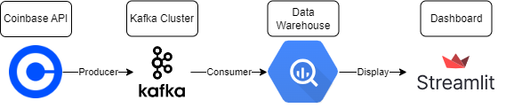
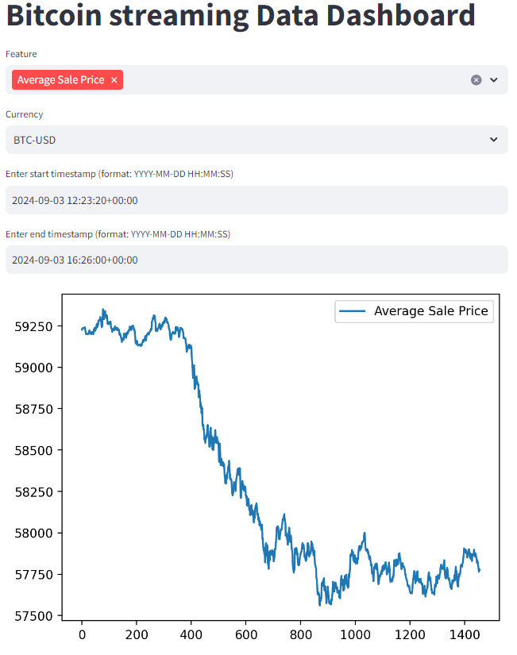
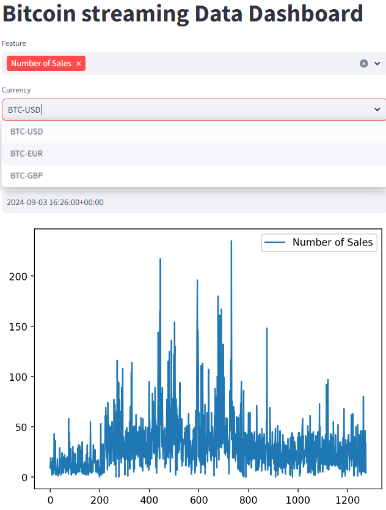
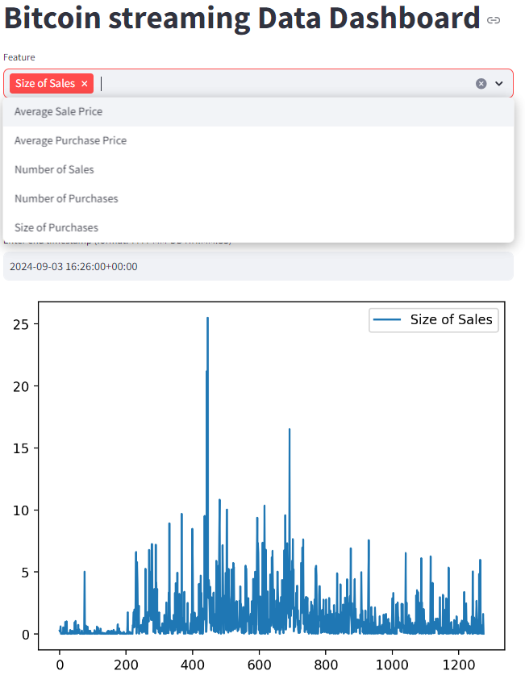

# Bitcoin streaming Data Dashboard

This project is a real-time Bitcoin trading dashboard that tracks and summarizes Bitcoin trades across three different currencies: EUR, USD, and GBP. The system uses Kafka to reliably stream trade data, helping to minimize the risk of message loss during transmission.

Key Features
- **Data Ingestion**: Trade data is continuously retrieved from the Coinbase API for the three currencies. Kafka is employed as the messaging layer to produce and consume these trades, providing fault tolerance and scalability.

- **Data Processing**: A Kafka consumer processes the incoming trade data, applying a tumbling window to aggregate and summarize trades over 10-second intervals. This method allows for real-time analysis and ensures that the trade data is efficiently processed and summarized.

- **Data Storage**: The summarized trade data is stored in Google BigQuery, enabling further analysis and providing a robust backend for querying and reporting.

- **Dashboard Visualization**: A Streamlit app acts as the user interface, where users can run custom queries against the stored data in BigQuery. The app dynamically visualizes the requested trade summaries, offering an interactive view of Bitcoin trading trends.

This project aims to be both scalable and fault-tolerant, providing a useful tool for real-time Bitcoin trade monitoring and analysis. It is also my capstone for the Data Engineering Zoomcamp.

Here are some screenshots of the Dashboard demonstrating the functionality:

There are still a few things that I will improve on such as:
- Cloud deployment: Use terraform to provision infrastructure and run this on GCP
- UI improvements: Make the plots of the UI more intuitive.